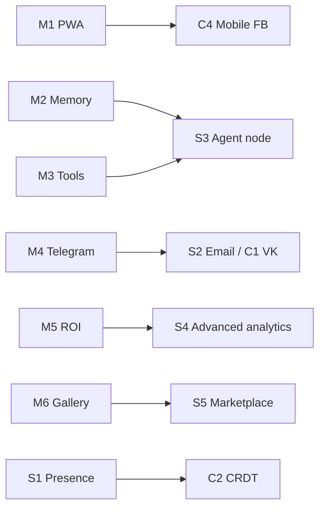

# MP.AI v1.1 Roadmap (6–8 weeks post v1.0)

**Horizon:** ~6–8 weeks after `v1.0.0`  
**Theme:** Mobile reach, richer agent graphs, more channels, team collab, deeper analytics.

---

## MoSCoW backlog

### Must (P0) — weeks 1–4

| ID | Item | Effort | Dependencies |
|----|------|--------|--------------|
| M1 | PWA shell (installable, offline shell, push opt-in stub) | M | Next.js manifest, service worker |
| M2 | Memory node + short-term session memory API | M | Flow executor, UsageEvent |
| M3 | Tool/function-calling node (HTTP + allowlist) | L | Sandbox, secrets vault |
| M4 | Telegram channel hardening (parity with WhatsApp ops) | M | Existing telegram_service |
| M5 | Org ROI report v1 (messages, tokens, estimated cost, conversion stub) | M | AnalyticsService, UsageEvent |
| M6 | Template gallery (read-only marketplace seed: 5–10 flows) | M | BotFlowRevision export/import |

### Should (P1) — weeks 3–6

| ID | Item | Effort | Dependencies |
|----|------|--------|--------------|
| S1 | Multi-user flow presence (who’s editing) + soft lock | L | WS gateway, RBAC |
| S2 | Email channel (transactional ingress + SMTP egress) | L | Provider credentials, templates |
| S3 | Agent node (sub-flow / multi-step planner, bounded) | L | Memory + tools |
| S4 | Advanced analytics dashboards (cohort, funnel per bot) | M | warehouse or SQL views |
| S5 | Template submit / review workflow for marketplace | M | Admin RBAC, moderation |

### Could (P2) — weeks 5–8

| ID | Item | Effort | Dependencies |
|----|------|--------|--------------|
| C1 | VK channel MVP | M | VK API app |
| C2 | Realtime CRDT / Yjs collaborative canvas | XL | S1, infra |
| C3 | Self-hosting pack (Helm/compose single-tenant, license key stub) | L | Docs, feature flags |
| C4 | Mobile-optimized flow-builder (touch palette) | M | PWA |

### Won’t (this horizon)

- Full multi-region active-active
- Custom LLM fine-tuning UI
- Native iOS/Android apps (PWA first)

---

## Technical dependencies

- **Org Stripe (v1.0)** is prerequisite for marketplace paid templates later.
- **WS execution** path reused for presence (S1).
- Self-host (C3) needs feature-flagged Stripe bypass + license.

## Effort key

| Size | Meaning |
|------|---------|
| S | ≤3 eng-days |
| M | ~1 week |
| L | ~2 weeks |
| XL | ≥3 weeks / spike |

**Team assumption:** 2 backend + 1 frontend + 0.5 design, 6–8 weeks ≈ 1.5–2 Must tracks in parallel.

## Suggested sequence

1. **Week 1–2:** M1 PWA + M6 templates seed + M5 ROI  
2. **Week 2–4:** M2 Memory + M3 Tools + M4 Telegram parity  
3. **Week 4–6:** S1 presence + S3 agent + S4 analytics  
4. **Week 6–8:** S2 Email, C1 VK or C3 self-host (pick one), polish

## Exit criteria for v1.1

- [ ] PWA installable on iOS/Android Safari/Chrome
- [ ] ≥3 new node types in production (memory, tool, agent or email)
- [ ] Template gallery live with ≥5 templates
- [ ] Org ROI report used by ≥50% of active paid orgs
- [ ] No Sev-0 regressions vs v1.0 billing/execute paths
