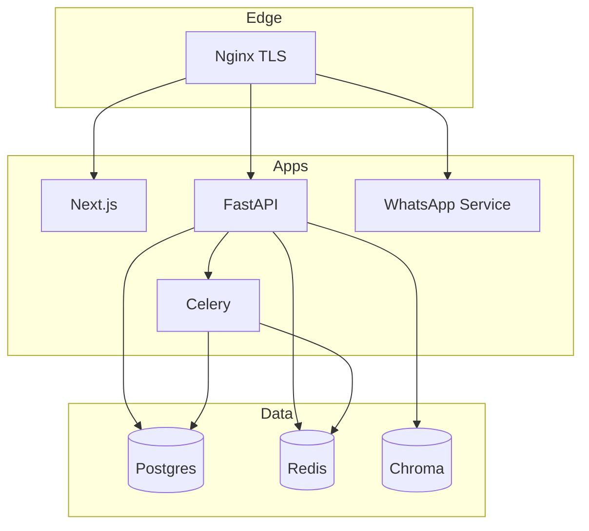

# MP.AI → Commercial SaaS v1.0 Roadmap

**Owner:** Principal Engineering  
**Status:** Launch-hardening (Phase 4) — product core + SaaS scaffolding **shipped**  
**Target:** GA v1.0 after checklist sign-off + design-partner soft launch

---

## Current state (as of this revision)

| Area | Status | Notes |
|------|--------|-------|
| Infra | ✅ | `deploy.sh`, `docker-compose.prod.yml`, nginx, WhatsApp service |
| Auth + tenancy | ✅ | JWT + refresh/reset stubs, RBAC, `X-Tenant-ID`, orgs/projects |
| Flow builder | ✅ | React Flow, Loop/Handoff, persist, publish revisions |
| Execution + RAG | ✅ | `FlowExecutionService`, `/execute`, WS execution, `RAGService` |
| Guardrails / rate limit | ✅ | Injection heuristics, SlowAPI, correlation IDs |
| Billing | ✅ | Org Stripe Customer, Checkout, Portal, webhooks, HTTP 402 quotas (verify live keys in checklist §5) |
| Tests / CI | 🟡 | Pytest + Playwright; security **blocks `v*` tags**; Locust file; staging load still open |
| Docs | ✅ | Checklist, legal pages, secrets rotation, user guides, runtime doc |

---

## Release trains

### Phase 0 — Foundations ✅
- UsageEvent + quotas hooks, Stripe skeleton, guardrails, Prometheus/OTel bootstrap
- BotFlowRevision, CI + preview workflow, core docs

### Phase 1 — Monetization ✅ (shipped in v1.0.0)
1. [x] Stripe Checkout PRO/ENTERPRISE → `Subscription` ACTIVE
2. [x] Customer Portal
3. [x] Debit wallet on LLM / execute
4. [x] Hard quotas enforced in UI + API
5. [x] Billing UI meters from `AnalyticsService`

> Close-out remaining: sign PRODUCTION_LAUNCH_CHECKLIST §5 against **live**
> Stripe keys / webhook (not a missing code path — operational verification).

### Phase 2 — Trust & ops ✅
1. [x] JSON logging + correlation ID
2. [x] Guardrails + rate limits
3. [x] Trivy / pip-audit / npm audit / gitleaks in CI (soft-fail on branches)
4. [x] Blocking CRITICAL/HIGH scans on release tags (`v*`)
5. [x] Grafana/Prometheus alert pack (`monitoring/alerts.yml`)

### Phase 3 — Product depth ✅
1. [x] Flow revisions + rollback API
2. [x] Loop / Human Handoff nodes
3. [x] Execute API + streaming WS
4. [x] Templates gallery (`/dashboard/templates`)
5. [x] Org-level Stripe customer (not only user wallet)

### Phase 4 — Launch hardening 🟡
1. [x] Locust file for `/execute`
2. [ ] Staging load test recorded (p95)
3. [ ] Backup/restore drill signed
4. [x] Legal ToS / Privacy linked (`/privacy`, `/terms`)
5. [ ] Soft launch → GA v1.0

---

## Target architecture (v1.0)

## Definition of Done — GA

- [ ] `PRODUCTION_LAUNCH_CHECKLIST.md` fully signed
- [ ] CI green on release tag; coverage path to ≥75% documented
- [ ] Design-partner NPS / severity-0 bugs cleared
- [x] Runbook: deploy, rollback, rotate secrets, WhatsApp session restore ([ops](./ops/PRODUCTION_DEPLOY.md), [rotation](./ops/SECRETS_ROTATION.md))

## Related docs

- [PRODUCTION_LAUNCH_CHECKLIST.md](./PRODUCTION_LAUNCH_CHECKLIST.md)
- [architecture/SAAS_V1.md](./architecture/SAAS_V1.md)
- [architecture/multi-tenant-ai-platform-architecture.md](./architecture/multi-tenant-ai-platform-architecture.md)
- [FLOW_BUILDER_RUNTIME.md](./FLOW_BUILDER_RUNTIME.md)
- [SAAS_BACKEND_CORE.md](./SAAS_BACKEND_CORE.md)
- [user/getting-started.md](./user/getting-started.md)
- [user/creating-first-bot.md](./user/creating-first-bot.md)
- [GA_RECOMMENDATIONS.md](./GA_RECOMMENDATIONS.md)
- [ops/SECRETS_ROTATION.md](./ops/SECRETS_ROTATION.md)
