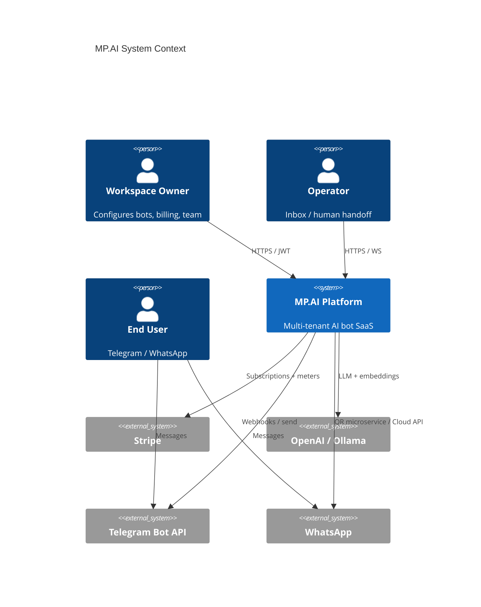
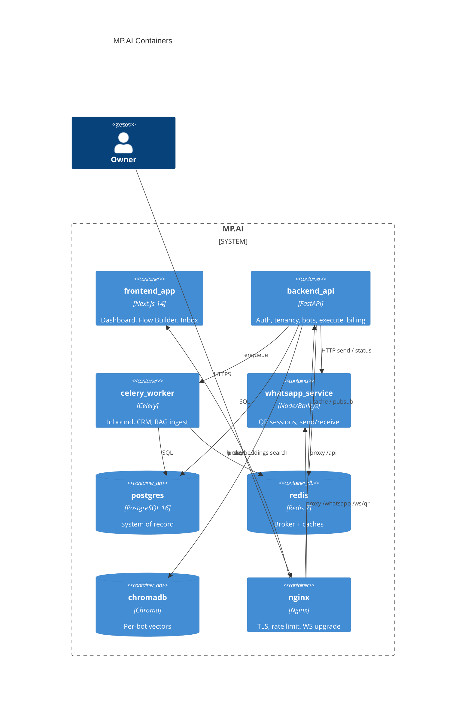
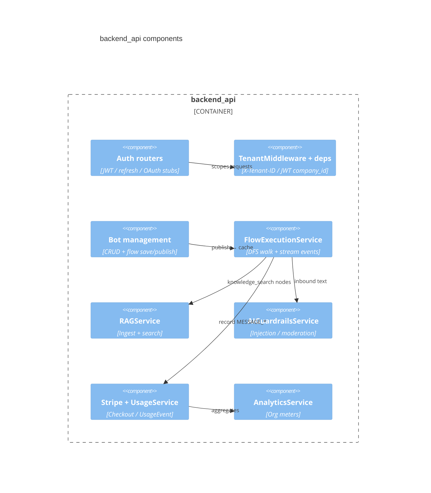

# MP.AI architecture — SaaS v1 (C4)

## Level 1 — System Context



## Level 2 — Containers



## Level 3 — Backend components (API)



## Domain model

```
User ──< UserCompanyWorkspace >── Organization (companies)
  │                                    └──< Project ──< Bot
  │                                                      ├── BotFlow (live graph)
  │                                                      ├── BotFlowRevision / BotFlowVersion
  │                                                      └── Integration / KnowledgeBase
  └── Subscription ──< BillingTransaction
                   └── UsageEvent
```

`bots.credentials` secrets are sealed at rest via `CREDENTIALS_ENCRYPTION_KEY`
(`aesgcm:` / legacy `enc:`). See also [`architecture_db.md.txt`](../architecture_db.md.txt)
(redirect + ER summary; do not use the old single-tenant draft).

## Request path (inbound message)

1. Messenger webhook → Celery inbound queue  
2. Quota / balance check  
3. `AIGuardrailsService.check_text`  
4. `FlowExecutor` / `FlowExecutionService` traversal  
5. `UsageService.record_and_debit`  
6. Outbound send + Prometheus counters  

## OpenAPI

- Interactive: `/docs` (Swagger)  
- Alternative: `/redoc`  
- Execute example: `POST /api/v1/bots/{bot_id}/execute` with `{ "message": "hello" }`  
- Auth example: `POST /api/v1/auth/login/json` → `access_token` + `refresh_token`
